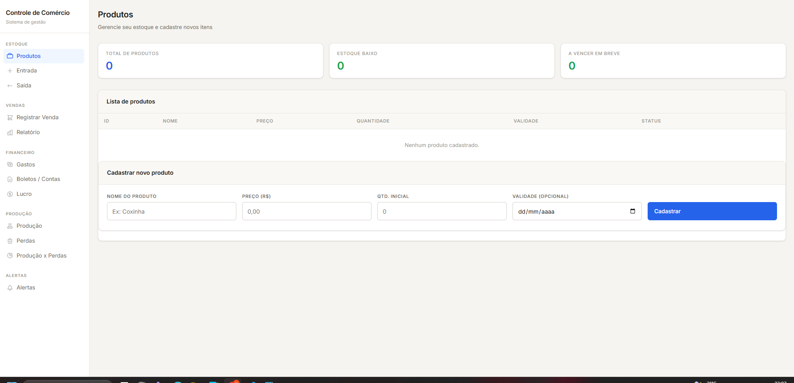
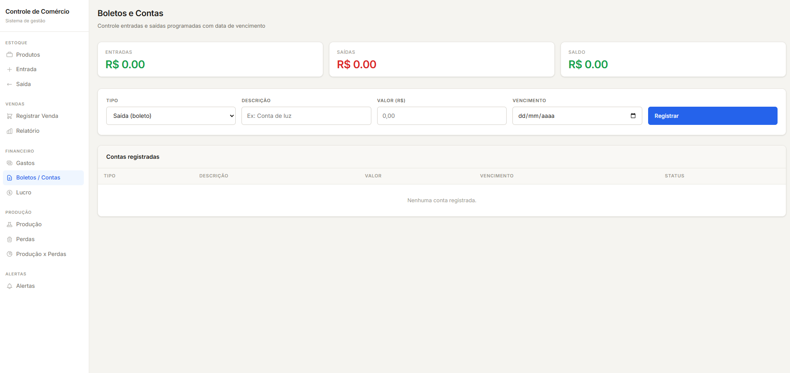

# 🧾 Sistema de Controle de Comércio (Padaria)

## 📌 Sobre o projeto

Este é um projeto pessoal desenvolvido com o objetivo de resolver um problema real do meu dia a dia de trabalho em uma padaria.

A proposta foi criar um sistema simples para auxiliar no controle de estoque, permitindo registrar entradas, saídas e acompanhar o estado atual dos produtos.

---

## 💡 Problema que motivou o projeto

No ambiente da padaria, identifiquei algumas dificuldades:

- Falta de controle claro de estoque (produção vs vendas)
- Dificuldade em visualizar lucro ou prejuízo
- Organização manual e sujeita a erros
- Falta de controle sobre validade de produtos

Este sistema foi desenvolvido como uma forma prática de atacar esses problemas.

---

## ⚙️ Funcionalidades atuais

- Cadastro de produtos
- Entrada de estoque
- Saída de estoque (vendas/uso interno)
- Controle de quantidade disponível
- Tratamento de erros (estoque insuficiente, dados inválidos, etc)
- Interface web simples para interação

---

## 🧠 Tecnologias utilizadas

- **Python**
- **Flask**
- **HTML e CSS**
- **JSON**

---

## ▶️ Como executar o projeto

1. Clone o repositório:
```bash
git clone https://github.com/vitorrodrigues-dev/controle-comercio.git
Acesse a pasta:
cd controle-comercio
Instale as dependências:
pip install -r requirements.txt
Execute o projeto:
python app.py
Acesse no navegador:
http://127.0.0.1:5000

📸 Preview do sistema

###Tela produtos


###Tela Boletos


 
📁 Estrutura do projeto
📦 projeto
 ┣ 📂 templates
 ┣ 📂 utils
 ┣ 📂 modulos
 ┣ 📜 app.py
 ┣ 📜 config.py
 ┗ 📜 README.md
🎨 Interface (UI/UX)

Mesmo sendo um projeto inicial, busquei aplicar:

Organização visual simples
Facilidade de uso
Fluxo direto para o usuário
Boas práticas básicas de design

Ainda tenho bastante espaço para evoluir nessa parte, principalmente em experiência do usuário.

🤖 Uso de IA no desenvolvimento

Durante o desenvolvimento utilizei IA como ferramenta de apoio para acelerar o aprendizado e a implementação.

No entanto, meu foco foi sempre compreender a lógica aplicada, revisando e ajustando o código conforme necessário, evitando dependência sem entendimento.

🧩 Sobre o tipo de sistema

Este projeto pode ser considerado um:

Sistema simples de controle de estoque com operações CRUD
Estrutura inicial semelhante a um ERP básico (em evolução)
⚠️ Limitações atuais
Persistência em JSON (não escalável)
Sem autenticação de usuários
Sem controle de concorrência (uso simultâneo)
Interface ainda simples

Esses pontos já estão mapeados para evolução futura.

🚀 Evolução planejada
Migração para banco de dados (MySQL)
Estudos em SQL e NoSQL já iniciados na faculdade
Organização do backend em camadas (services)
Melhorias de UI/UX
Implementação de relatórios e produção
🎯 Diferencial do projeto

Este projeto não foi baseado em tutorial.

Ele surgiu de um problema real observado no ambiente de trabalho (padaria), o que guiou tanto o escopo quanto as decisões de implementação.

Isso permitiu trabalhar com regras de negócio reais, como controle de estoque, perdas e fluxo de produtos.

🚀 Objetivo com este projeto
Consolidar conhecimentos em Python
Entender integração entre backend e frontend
Trabalhar com lógica de negócio real
Criar base para projetos mais robustos no futuro